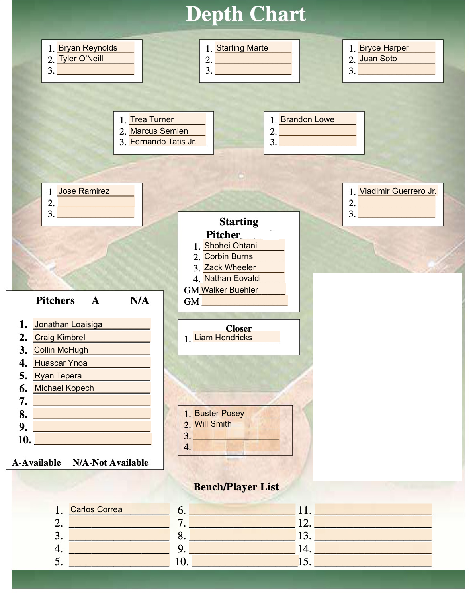
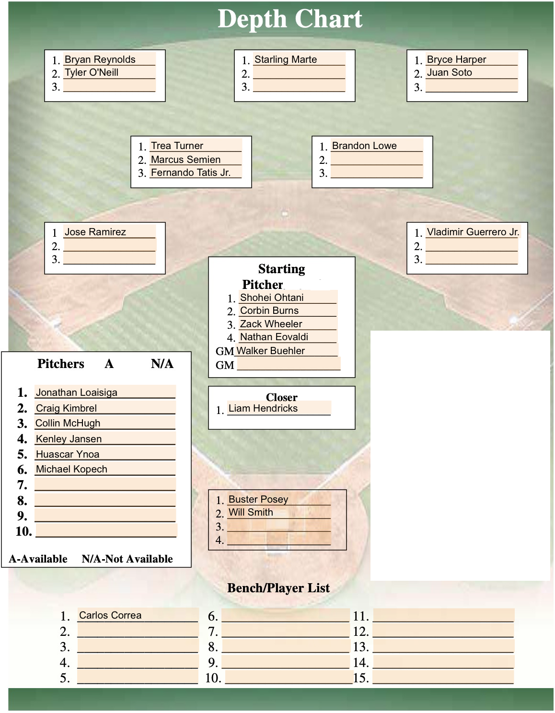
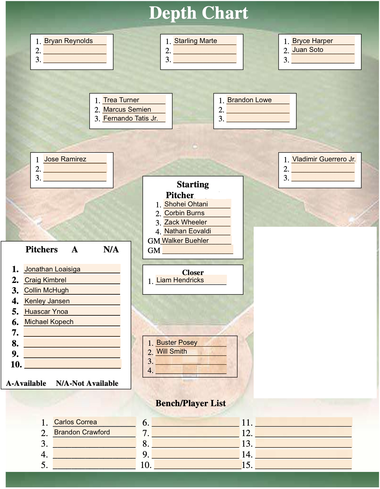

```{r, load-packages, echo=FALSE}
suppressMessages(library(tidyverse))
library(knitr)
```

### Introduction

Linear programming is a mathematical method for solving optimization problems in which the objective function and constraints are all in a linear format. A subset of the field of linear programming is integer programming, in which the variables are restricted to be strictly integers. By restricting the variables to take the value of $0$ or $1$, optimization problems can be created to determine whether a particular element is present in a solution. In this paper, we will be using integer programming to determine what the best possible MLB team we could create among players from the 2021 season. The code for the creation of the dataset, data manipulation, and creation of the lpsolve input files can be found at the following [**link**](https://github.com/djl1626/MATH381.git).

### The Data

The integer program written to answer this question requires four different elements: the players, their contractual details, their position, and their fWAR (FanGraphs Wins Above Replacement) will be used as the optimization statistic. fWAR is a metric that is used to answer the question "if this player got injured and needed to be replaced with a readily available bench or replacement player, how much value would be lost?" This value is represented as wins, leading to fWAR. A replacement level player is said to have a $0.0$ fWAR. A league average full time position player is worth approximately $2.0$ fWAR, while bench players tend to sit around $0-1.0$. More on this statistic can be read at this [**link**](https://library.fangraphs.com/misc/war/).\
\
The minimum salary for Major League Baseball in 2021 was \$570,500. However, when collecting the contractual information for the players in the data set, many were under this minimum amount. This happens because they may not have played in the MLB for the entire year, and thus would not be subject to the minimum salary. However, for this paper, we are constructing a team as if we were going to play a full season. Thus, it is necessary to set any player's salary that was listed as under \$570,500 to \$570,500 for the purpose of this paper. This is so that the full amount that a player would be paid is taken into account for the team's salary constraint.\
\
Some players positions were listed as a grouping of positions. For example, some pitchers that made appearances both starting and relieving were originally listed as a generic "P" for pitcher. In any of case where a player was not given a listed position representing one of the 8 positions in the field, $\textrm{1B,2B,3B,SS,LF,CF,RF}$ or one of the pitching positions, $\textrm{SP,RP,CL}$, the player's position was according to the position in which they played the majority of their games in 2021. There were a few cases in which there was a tie. In each of these cases, it was dealing with a player who had spent the majority of the year in the minor leagues. In these cases, the player's listed position was determined by selecting the position that the player played in the majority of their minor league games in 2021.\
\
fWAR is a statistic that accumulates over time. So, it is reasonable to ask whether players with less volume should have their fWAR prorated as if they played an entire season. While this makes sense in some cases, namely players that got injured, it is illogical in others. For example, players with very small sample sizes can lead to prorated fWAR's that are unheard of. Take Josh Lowe for instance. In two plate appearances, he produced a .1 Total fWAR. That's a 25.1 fWAR pace over 502 plate appearances. The best player in our dataset had an 8.1 fWAR and was the American League MVP in 2021. A 25.1 fWAR is absurd and would almost positively never happen. As a result, we will not prorate fWAR numbers for any players. Instead, we will treat all players exactly to how they performed in 2021 both in volume and production.
\
The data used in this paper was collected from 3 different sources: [**Spotrac**](https://www.spotrac.com/mlb/contracts/), [**Baseball Reference**](https://www.baseball-reference.com), and [**FanGraphs**](https://www.fangraphs.com). Most of the player's contract information was gathered from Spotrac, with some additional being taken from Baseball Reference. The fWAR was taken from FanGraphs. The final dataset can be found at this on the GitHub page as `final_table_for_LP.csv`.\
\

### IP Formpulation

Data was collected on $1507$ players from the 2021 MLB season. Each player is assigned a variable $x_i:i\in \{1,2,...,1506,1507\}$. Then, let:\
$$x_{\boldsymbol{i}} = \begin{cases} 
      0 & \textrm{player } \boldsymbol{i} \textrm{ not on the team}\\
      1 & \textrm{player } \boldsymbol{i} \textrm{ on the team} 
   \end{cases}$$
Additionally, let $\textbf{X}$ be the vector of variables representing each player in the dataset such that $\textbf{X}_i$ corresponds to player $i$.

Then, let $\textbf{W}$ be the vector of fWAR values such that $\textbf{W}_i$ is the fWAR of player $i$. Thus, the objective for maximizing the fWAR of our fictional team is:
$$\max: \textbf{W}\cdot \textbf{X}$$

A MLB roster consists of $26$ players. By summing up all of the entries in $\textbf{X}$, we can determine how many players are on the roster. Thus, we institute a constraint as follows:
$$\sum\limits_{i=1}^{1507}x_i \leq 26$$
Within the roster, it is conventional to have a minimum number of each position. The table below shows what is widely considered the minimum number of players at each position for a MLB roster. Not all teams structure their rosters in this way, but is it the most conventional.\

```{r, echo=FALSE}
min_positions_table <- data.frame("Positions" = c("Starting Pitchers (SP)", "Relief Pitchers (RP)", "Closer (CL)", "Catchers (C)", "First Base (1B)", "Second Base (2B)", "Third Base (3B)", "Shortstop (SS)", "Left Field (LF)", "Center Field (CF)", "Right Field (RF)", "Infield (IF)", "Outfield (OF)"),
                                  "Minimum" = c(5, 6, 1, 2, 1, 1, 1, 1, 1, 1, 1, 5, 4))
kable(min_positions_table)
```
While it is possible to have more than $5, 6, \textrm{and } 1$ starting pitchers, relief pitchers, and closing pitchers respectively, it is very rarely the case that a team would willingly play a game with a single bench player. Thus, for this IP, the minimum numbers for the pitchers will be taken as a hard number for the roster. We can now see that there will be $3$ extra roster spots to fill after satisfying the roster requirements.\
\
By summing the variables corresponding to all players that play a particular position, we can determine how many players we have at each position. So, we create the following constraints:\
Let $\mathbb{A}_p=\{\textrm{player i plays position}\ p\}$, $p\in\{\textrm{1B,2B,3B,SS,LF,CF,RF}\}$. \
Additionally, let $Inf = \{\textrm{1B,2B,3B,SS\}}$ and $OF=\{\textrm{LF,CF,RF}\}$.\
\
$$\sum\limits_{i\in \mathbb{A}_{SP}}x_i =5$$
This is the constraint for the starting pitchers.
$$\sum\limits_{i\in \mathbb{A}_{RP}}x_i =6$$
This is the constraint for the relief pitchers.
$$\sum\limits_{i\in \mathbb{A}_{CL}}x_i =1$$
This is the constraint for the closing pitcher.
$$\sum\limits_{i\in \mathbb{A}_{C}}x_i \geq 2$$
This is the constraint for the catchers.
$$\forall p:\sum\limits_{i\in \mathbb{A}_{p}}x_i \geq 1$$
This is the constraint saying there must be one of every other fielding position on the roster.
$$\sum\limits_{i\in \mathbb{A}_{Inf}}x_i \geq 5$$
This is the constraint requiring at least $1$ infielder on the bench.
$$\sum\limits_{i\in \mathbb{A}_{OF}}x_i \geq 4$$
This is the constraint requiring at least $1$ outfielder on the bench.\
\
We now have constraints in place to ensure the team's roster is constructed logically. The final constraint that we will have in place is the luxury tax constraint. In 2021, the luxury tax threshold was placed at \$210 million. While teams can go over that, we will create a constraint to ensure that our team does not.\
Let $\textbf{S}$ be the vector of salaries such that $\textbf{S}_i$ is the salary for player $i$ in millions of dollars. Thus, our luxury tax constraint is as follows:
$$\textbf{S}\cdot \textbf{X} \leq 210$$

\newpage

### Complete IP

The complete IP is as follows:
$$\max: \textbf{W}\cdot \textbf{X}$$
$$\sum\limits_{i=1}^{1507}x_i \leq 26$$
$$\sum\limits_{x_i\in \mathbb{A}_{SP}}x_i =5$$
$$\sum\limits_{x_i\in \mathbb{A}_{RP}}x_i =6$$
$$\sum\limits_{x_i\in \mathbb{A}_{CL}}x_i =1$$

$$\forall p:\sum\limits_{x_i\in \mathbb{A}_{p}}x_i \geq 1$$

$$\sum\limits_{x_i\in \mathbb{A}_{Inf}}x_i \geq 5$$
$$\sum\limits_{x_i\in \mathbb{A}_{OF}}x_i \geq 4$$
$$\textbf{S}\cdot \textbf{X} \leq 210$$
$$\forall i\in \{1,2,...,1506,1507\}:x_i\in\{0,1\}$$
\newpage

### Solution

##### Input File

The following is the lpsolve input file generated by python file `A8_create_lpsolve_file.py` from the GitHub page.\
\
max:6.7x_1+5.0x_2+...+-0.3x_1506+-0.7x_1507;\
x_1126+x_1127+...+x_1413+x_1414=5;\
x_600+x_601+...+x_1124+x_1125=6;\
x_423+x_424+...+x_455+x_456=1;\
x_1+x_2+x_3+...+x_1505+x_1506+x_1507<=26;\
payroll=0.6054x_1+5.0x_2+...+0.5705x_1506+1.225x_1507;\
catchers=x_217+x_218+...+x_330+x_331;\
first_basemen=x_1+x_2+...+x_61+x_62;\
second_basemen=x_63+x_64+...+x_146+x_147;\
third_basemen=x_148+x_149+...+x_215+x_216;\
shortstops=x_1415+x_1416+...+x_1506+x_1507;\
left_fielders=x_457+x_458+...+x_528+x_529;\
center_fielders=x_332+x_333+...+x_421+x_422;\
right_fielders=x_530+x_531+...+x_598+x_599;\
infielders=x_1+x_2+...+x_213+x_214+x_1414+x_1415+...+x_1506+x_1507;\
outfielders=x_332+x_333+...+x_421+x_422+x_457+...+x_529+...+x_598+x_599;\
payroll<=210;\
catchers>=2;\
first_basemen>=1;\
second_basemen>=1;\
third_basemen>=1;\
shortstops>=1;\
left_fielders>=1;\
center_fielders>=1;\
right_fielders>=1;\
infielders>=5;\
outfielders>=4;\
bin x_1,x_2,...,x_1506,x_1507;\
\

##### Output File

The following is the output produced by lpsolve from the above input file.\
\
Value of objective function: 131.00000000\
\
Actual values of the variables:\
x_1                             1\
x_63                            1\
x_148                           1\
x_217                           1\
x_218                           1\
x_332                           1\
x_423                           1\
x_457                           1\
x_458                           1\
x_530                           1\
x_531                           1\
x_600                           1\
x_601                           1\
x_602                           1\
x_604                           1\
x_605                           1\
x_818                           1\
x_1126                          1\
x_1127                          1\
x_1128                          1\
x_1129                          1\
x_1130                          1\
x_1415                          1\
x_1416                          1\
x_1417                          1\
x_1418                          1\
payroll                   209.435\
catchers                        2\
first_basemen                   1\
second_basemen                  1\
third_basemen                   1\
shortstops                      4\
left_fielders                   2\
center_fielders                 1\
right_fielders                  2\
infielders                      7\
outfielders                     5\
\
All other variables are 0.

\newpage

##### Results:
\
Below is a graphic illustrating the depth chart of the roster solution created by lpsolve. The positions are ordered from largest to lowest fWAR. The final shortstop, Carlos Correa, is listed on the bench because there was no more slots available at the shortstop position. 

<center>

{height=50%}

</center>

In this solution, we see that the extra roster spots are filled by one outfielder and two infielders. From this graphic, we can see the extra infielders are Fernando Tatis Jr. and Carlos Correa. The 5th infielder is Marcus Semien. This can be seen because all of the extra infielders are shortstops, and the graphic is ordered by fWAR from greatest to least. Thus, the players higher on the depth chart are the "starters" for this fictional team. In order to tell who the bench and extra outfielders are, we must look at the dataset. The additional outfielders on the roster are Juan Soto and Tyler O'Neill. Soto has a higher fWAR than O'Neill, so we conclude that Soto is the 4th outfielder and O'Neill the extra outfielder.\
\
While it is odd to construct a roster with 4 shortstops, it makes sense that this was the solution to the IP. Shortstop is one of the premium positions in the MLB. Many of the best players in the game are young shortstops. This means that they have a high fWAR and low salary, making them prime targets to be selected as the optimal roster based on this IP.

\newpage

### Addition Scenarios: Over the Luxury Tax

In this section, we altered the original lpsolve input file to account for a team that is willing to go over the luxury tax threshold by \$20 million. This is something that frequently happens in real life. As teams believe they are closer to winning the World Series, they are more willing to go over the luxury tax threshold and accept the penalties. Thus, we adjust our payroll constraint to be at most \$230, and run lpsolve again. \

##### Output File:
\
Value of objective function: 131.20000000\
\
Actual values of the variables:\
x_1                             1\
x_63                            1\
x_148                           1\
x_217                           1\
x_218                           1\
x_332                           1\
x_423                           1\
x_457                           1\
x_458                           1\
x_530                           1\
x_531                           1\
x_600                           1\
x_601                           1\
x_602                           1\
x_603                           1\
x_604                           1\
x_818                           1\
x_1126                          1\
x_1127                          1\
x_1128                          1\
x_1129                          1\
x_1130                          1\
x_1415                          1\
x_1416                          1\
x_1417                          1\
x_1418                          1\
payroll                   227.685\
catchers                        2\
first_basemen                   1\
second_basemen                  1\
third_basemen                   1\
shortstops                      4\
left_fielders                   2\
center_fielders                 1\
right_fielders                  2\
infielders                      7\
outfielders                     5\
\
All other variables are 0.

##### Results
\

Below is a graphic illustrating the depth chart of the roster solution created by lpsolve. The positions are ordered from largest to lowest fWAR.

<center>

{height=50%}

</center>

After changing the maximum payroll, we still see almost the exact same team. The only difference is Ryan Tepera is replaced by Kenley Jansen. This increases the fWAR of the team to 131.2, a .2 increase, while increasing the payroll to \$227.685 million, a \$18.25 increase. This seems like a steep price to pay for a .2 fWAR increase. 

### Additional Scenarios: No Luxury Tax Threshold
\
We have just seen that increasing the payroll constraint to \$230 million barely changed the roster and thus total fWAR of the team. We now want to determine how good our team is compared to the best possible team. In order to find the best possible team, we will remove the payroll constraint altogether. This solution will then be the best possible team that can satisfy the roster constraints. 

##### Output File:
\
The following is the output file produced by the altered lpsolve input file.\
\
Value of objective function: 131.30000000\
\
Actual values of the variables:\
x_1                             1\
x_63                            1\
x_148                           1\
x_217                           1\
x_218                           1\
x_332                           1\
x_423                           1\
x_457                           1\
x_530                           1\
x_531                           1\
x_600                           1\
x_601                           1\
x_602                           1\
x_603                           1\
x_604                           1\
x_818                           1\
x_1126                          1\
x_1127                          1\
x_1128                          1\
x_1129                          1\
x_1130                          1\
x_1415                          1\
x_1416                          1\
x_1417                          1\
x_1418                          1\
x_1419                          1\
payroll                   242.291\
catchers                        2\
first_basemen                   1\
second_basemen                  1\
third_basemen                   1\
shortstops                      5\
left_fielders                   1\
center_fielders                 1\
right_fielders                  2\
infielders                      8\
outfielders                     4\
\
All other variables are zero.

\newpage

##### Results:
\

Below is a graphic illustrating the depth chart of the roster solution created by lpsolve. The positions are ordered from largest to lowest fWAR.

<center>

{height=50%}

</center>
\

With no payroll constraint, the best possible team that can be constructed has a total fWAR of 131.3. This comes with a payroll of \$242.291. The original IP that was solved with the luxury tax constraint set to \$210 million yielded a team total fWAR of 131 at a payroll of \$209.435 million. \$32.856 is a ridiculous price to pay for .3 fWAR. The roster constructed from the original IP is very nearly as valuable as the best possible team when ignoring the luxury tax, and comes at a much cheaper cost. \
\
There is only one difference in this roster compared to the roster created by the increased luxury tax threshold. Tyler O'Neill is removed in favor of Brandon Crawford. With no constraint on salary, Crawford can be selected instead of O'Neill with no consquence except increasing the objective function by .1.
